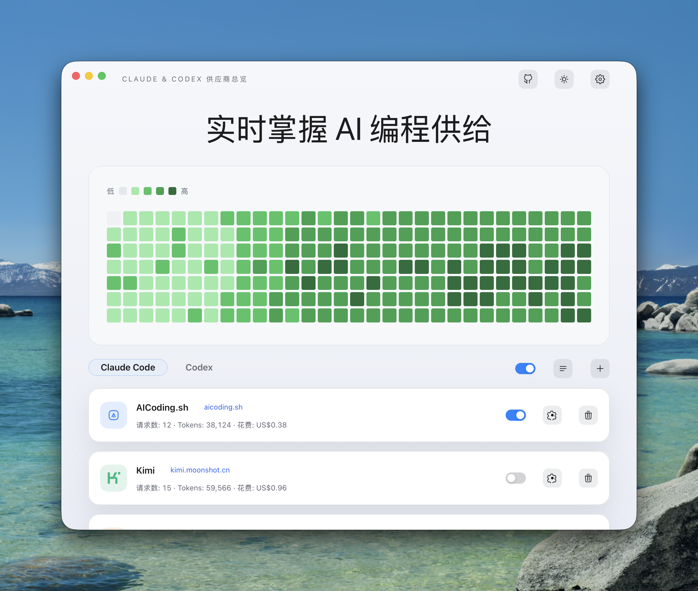
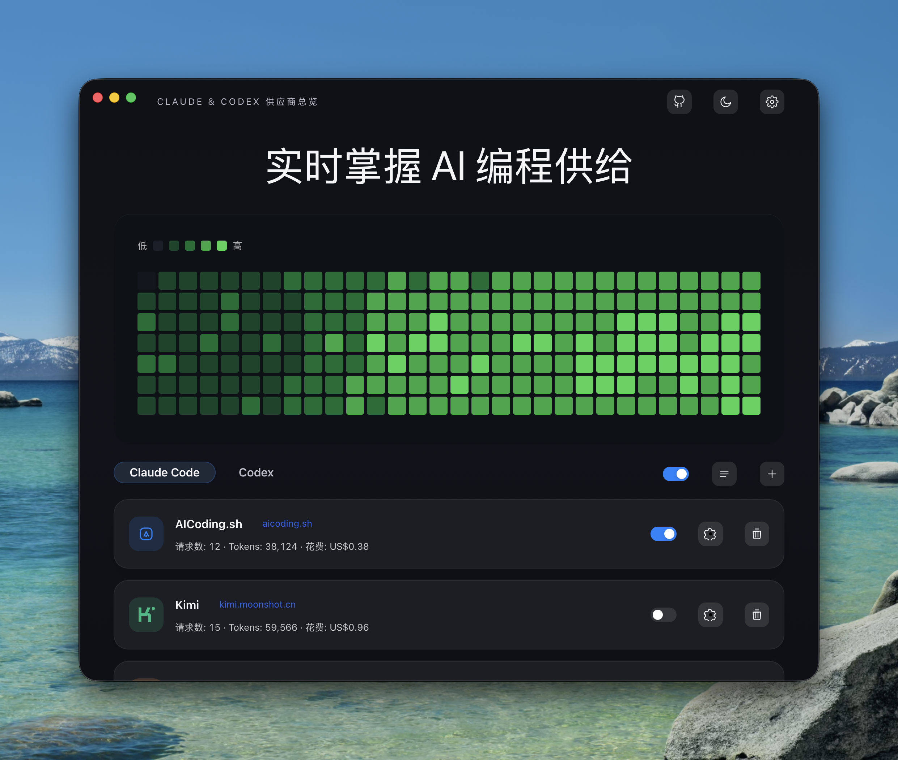
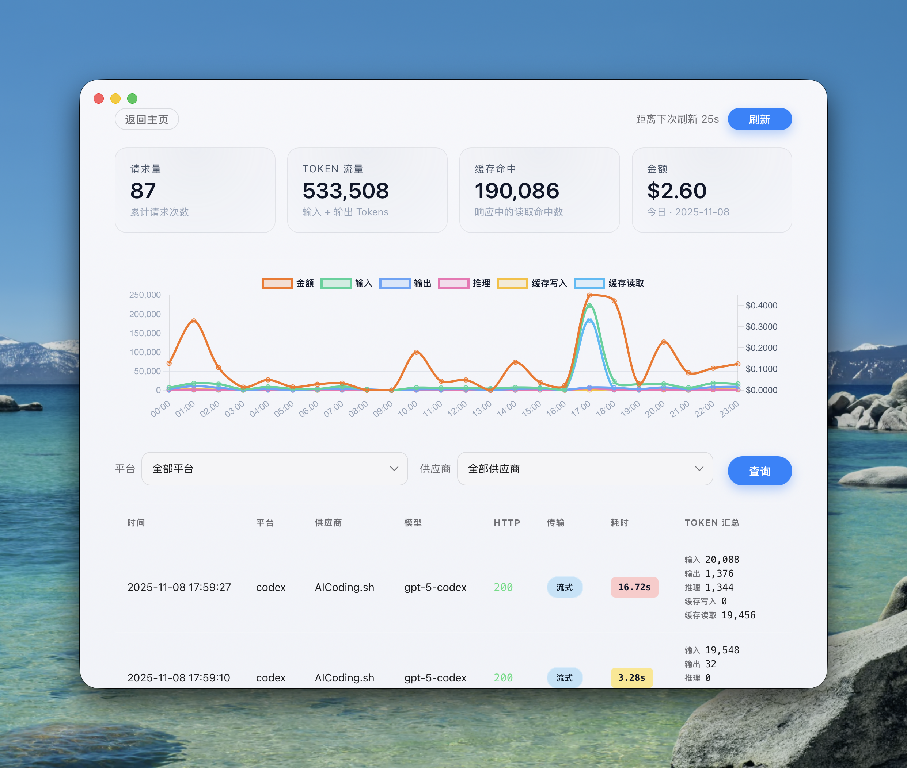
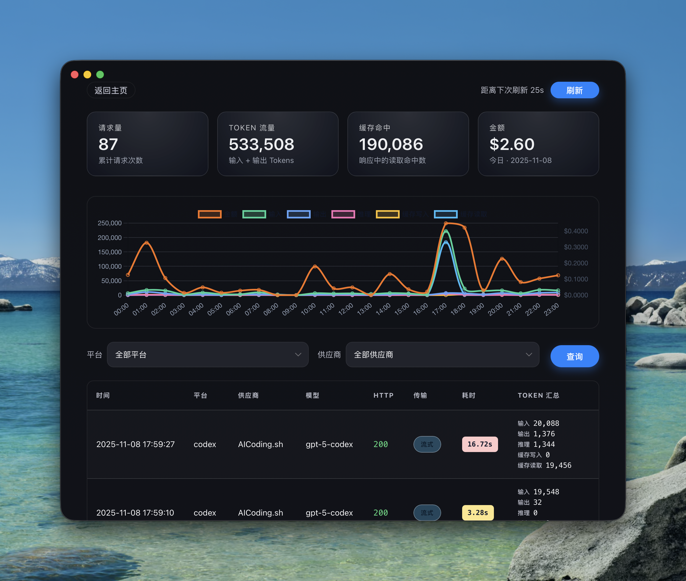

# Code Switch X

Claude Code 与 Codex 的本地供应商管理器。

> 本项目 clone 自 https://github.com/daodao97/code-switch，并在此基础上围绕应用隔离、配置兼容与 DeepSeek 协议转换做了优化。

## 功能
- 统一管理 Claude Code 与 Codex 供应商，无需重启 CLI 即可切换。
- 支持多供应商降级、模型映射、请求日志、用量统计与成本展示。
- 支持 DeepSeek 兼容模式：Codex 请求可自动适配到 DeepSeek Chat Completions。
- 支持可选原始请求/响应日志，默认关闭，敏感 header 会脱敏。
- 支持 Claude/Codex MCP Server 管理、Claude Skill 仓库管理和 cc-switch 配置导入。
- 使用独立的 `code-switch-x` 数据、备份和启动项标识，避免覆盖原有安装数据。

基于 [Wails 3](https://v3.wails.io)

## 工作方式

应用会在本机启动一个 HTTP relay，默认监听 `127.0.0.1:18101`，可在设置中调整端口（重启后生效）。

Code Switch X 会更新 Claude Code 与 Codex 配置，让 CLI 指向本地 relay，再由 relay 根据当前供应商配置转发请求。

兼容端点：
- `/v1/messages` -> Claude 供应商
- `/responses`、`/v1/responses` -> Codex 供应商

## 下载

[macOS](https://github.com/mysekai7/code-switch-x/releases) | [Windows](https://github.com/mysekai7/code-switch-x/releases) | [Linux (amd64)](https://github.com/mysekai7/code-switch-x/releases)


## 预览





## 开发准备
- Go 1.24+
- Node.js 18+
- npm
- Wails 3 CLI：`go install github.com/wailsapp/wails/v3/cmd/wails3@latest`

发布打包额外依赖：
- `yq`：更新 Wails 与 Linux 包版本信息
- `makensis`：生成 Windows 安装器
- `gh`：仅在上传 GitHub Release 时需要

## 开发运行
```bash
wails3 task dev
```

## 构建流程
1. 同步 build metadata：
   ```bash
   wails3 task common:update:build-assets
   ```
2. 打包 macOS `.app`：
   ```bash
   wails3 task package
   ```

### 交叉编译 Windows (macOS 环境)
1. 安装 NSIS / `makensis`：
   ```bash
   brew install makensis
   ```
2. 运行 Windows 任务：
   ```bash
   env ARCH=amd64 wails3 task windows:build
   # 生成安装器
   env ARCH=amd64 wails3 task windows:package
   ```

## 发布
脚本 `scripts/publish_release.sh v0.1.0` 会自动打包并校验以下资产（macOS 会分别构建 arm64 与 amd64），默认不上传 GitHub Release：
- `codeswitch-x-macos-arm64.zip`
- `codeswitch-x-macos-amd64.zip`
- `CodeSwitchX-amd64-installer.exe`
- `CodeSwitchX.exe`

若脚本在 Linux 主机运行且未设置 `SKIP_LINUX=true`，还会生成：
- `codeswitch-x-linux-amd64.deb`
- `codeswitch-x-linux-amd64.rpm`
- `codeswitch-x-linux-amd64.pkg.tar.zst`

只打包并校验资产：
```bash
scripts/publish_release.sh v0.1.0
```

打包并创建 GitHub Release：
```bash
UPLOAD_RELEASE=true scripts/publish_release.sh v0.1.0
```

手动打包本机 macOS `.app` 与 Windows 安装器：
```bash
wails3 task package
env ARCH=amd64 wails3 task windows:package
```

## 常见问题
- 若 `.app` 无法打开，先执行 `wails3 task common:update:build-assets` 后再构建。
- macOS 交叉编译需要终端拥有完全磁盘访问权限，否则 `~/Library/Caches/go-build` 会报 *operation not permitted*。
